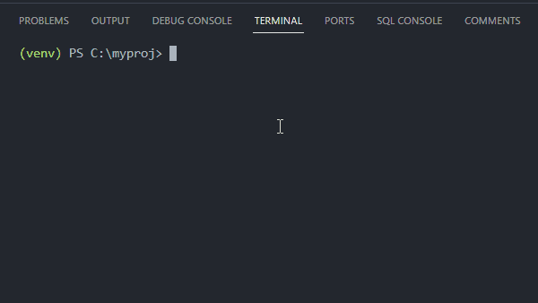
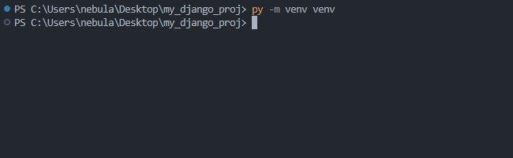

<div align = "center">

</img>

<h1>KeywordShortener</h1>

<p>Coding is about creativity, not keyboard acrobatics</p>

[](https://www.gnu.org/licenses/gpl-3.0.en.html)

</div>


## Description
Define custom keywords and assign them specific commands. For example, type `pipfreqs` and press `Space` to replace it with `python -m pip install -r requirements.txt`


## Sample Video
</img>


## Installation
1. Create a virtual environment and activate it:
```
python -m venv venv && venv\scripts\activate
```
2. Install required dependencies:
```
python -m pip install -r requirements.txt
```
3. Run the script in the background:
```
pythonw keyword_shortener.pyw
```
> To run the script in the terminal, use `python` instead of `pythonw`


## Run on startup (Windows)
4. To run the script in the background on startup, you will have to install `pynput` and `pyperclip` to the global environment (100 Kb):
```
deactivate && pip install -r requirements.txt
```
5. Press `Win + R` and enter `shell:startup`
1. Add a shortcut for `keyword_shortener.pyw` there.
1. Either reboot your computer or run:
```
pythonw keyword_shortener.pyw
```
> To stop the script, open up Task Manager with `Ctrl + Shift + Esc` -> Details.<br>Find the `pythonw.exe` process and end it.


## Keyword Shortcuts Examples
| Keyword | Corresponding value |
| ------- | ------------- |
| pmr | python manage.py runserver |
| djproj | django-admin startproject |
| pmmkmg | python manage.py makemigrations |
| pmmg | python manage.py migrate |
| covtest | coverage run manage.py test |
| pyvenvact | python -m venv venv && venv\\scripts\\activate |
| pipfreqs | python -m pip install -r requirements.txt |
| dcupb | docker-compose up -d --build |
| gramcor | Does it sound grammatically correct? |
| mw | https://www.merriam-webster.com/dictionary/ |
> and many more...


## Create Your Own Keywords
All keywords are stored in the `config` folder where you can specify your own keywords and values.
<br>
They are separated into different json files for convenience. The only thing you should do is either create a custom json file or modify the existing ones.


### Pressing Enter and executing multiple commands at once
To simulate pressing `Enter` when replacing a keyword, include `\n` in your value. For example, if I'd like to generate a random number in python shell, my json file would look like this:
```json
{
    "pygenrand": "python\nimport random\nprint(random.random())\n"
}
```
So pynput treats every `\n` as a newline and presses `Enter`. It is useful when you want to press Enter right after the script typed your value.
<br>
> [!IMPORTANT]
> Keep in mind, that pynput types the keyword value without a pause. So if you have several commands and one of them takes some time to execute, it's not going to work.

If you want to run multiple commands in a sequence, it's better to write all your commands in one line with a `&&` separator, like this:
```json
{
    "testing": "python -m venv venv && venv/scripts/activate && python -m pip install django && django-admin startproject myproj . && python manage.py startapp myapp && python manage.py runserver\n"
}
```
This will successfully create and activate a virtual environment, install Django, start a new project, create a new app and run a server.


## Limitations
When you press a `Backspace` key even once, `self.current_word` is set to an empty string. It is an intentional behavior since there is no way for the script to know (without complicating the code) whether you previously selected the whole string with `Ctrl + A` for example, hence deleting not one, but multiple characters.


## How does it work?
1. When the script starts, set `self.current_word = ''`
1. When you press any key, `time_since_last_press` is calculated.
1. Check if any modifier key, like `Ctrl`, is pressed.
* If it is, no further code is executed.
> [!NOTE]  
> Because of this, when defining your keywords, you can't use characters that require a pressed `Shift`, like an underscore `_`
4. Check if the pressed key is `self.STOP_KEY`
* If it is, stop the script completely (end the process).
5. Check if the pressed key belongs to the `pynput.keyboard.Key` class (whether it is a modifier key, like `Shift`).
* If it is a modifier key, check if it is `Space`
* If it is, execute the main `replace_keyword_with_value` method that tries to find `self.current_word` key in the `self.KEYWORD_BINDINGS` dictionary. If there is such a key, press `Backspace` for every character in the `self.current_word` + 1 (for the Space) and type the corresponding keyword value.
6. Check if the elapsed time between key presses `time_since_last_press` exceeds `self.RESET_AFTER` limit.
* If it does, set `self.current_word = ''`
7. Check if the pressed key is a character key, like `a` or `1`
* If it is, concatenate this key to `self.current_word` and return None.
8. If any exception occurred during the key press, log this exception to `keyword_logger.log` file with the exception timestamp, pressed key and the exception message.
9. Set `self.current_word = ''`


# Legacy Version
Previously, `KeywordShortener` included hotkey activation and copying current window's content to the clipboard which proved to be inefficient and prone to occasional keyboard freezes when clipboard contained a lot of text. You can find legacy code in the `legacy` folder. Here is the legacy documentation.


### Description (legacy)
Create custom keyword shortcuts and run them in the background. For example, type `pipfreqs`, press the hotkey ``Left Alt + ` (backtick)`` to replace it with `python -m pip install -r requirements.txt`
> Additionally, you can pass the `-ne | --no-enter` flag after the keyword, which will not press `Enter` after script execution.
<br>For example, `? -ne hash` or `? hash --no-enter` will type `What is hash` and will not press `Enter`


### Sample Video (legacy)
</img>


### Create Your Own Keywords (legacy)
All regular keywords are stored in the `config` folder where you can specify your own keywords and their values.
<br>
They are separated into different json files only for convenience. The only thing you should do is either create a custom json file or modify the existing ones.
<br>
> You can add your own hotkeys by modifying the `TRIGGER_COMBINATIONS` attribute of the `KeywordShortener` class.


### Limitations (legacy)
To avoid unexpected keyboard behavior, the limit for the `ARGUMENTS_LENGTH_LIMIT` was set to `100` characters, i.e. if you accidentally activate a hotkey, it will not freeze the keyboard until the whole text is typed.